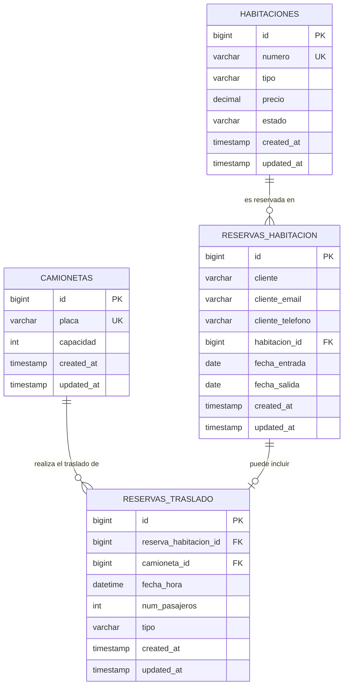

# Documentación del Proyecto: Hotel Maya Bay - Sistema de Reservaciones y Traslados

Esta es la documentación técnica y de usuario para la plataforma de gestión del **Hotel Maya Bay**, migrado a **Laravel** con soporte para la asignación inteligente de habitaciones y servicios de traslado.

---

## 1. Alcance

* **Descripción corta:**  
  La plataforma web del **Hotel Maya Bay** está diseñada para la gestión integral de un hotel boutique que cuenta con un inventario fijo de **40 habitaciones** distribuidas en 3 categorías (Estándar, Familiar y Premium) y una flota de **3 camionetas de traslado** (con capacidades de 6, 8 y 10 pasajeros). El sistema permite a los usuarios reservar habitaciones en tiempo real y, de manera opcional, solicitar un servicio de traslado coordinado (check-in o check-out).

* **Objetivos del sistema:**  
  Automatizar el **agendamiento doble (habitación + transporte)**. La plataforma garantiza de forma transaccional que:
  1. Se asigne una habitación disponible del tipo seleccionado libre de solapamientos de fechas.
  2. Si el huésped solicita traslado, se le asigne automáticamente una camioneta de la flota que cuente con suficiente capacidad de pasajeros disponible para la fecha y hora exactas indicadas. Si todos los vehículos están saturados en ese horario, la reserva se detiene para evitar sobreventas.

---

## 2. Arquitectura y Tecnologías

* **Lista de software utilizado:**
  * **Lenguaje de Programación:** PHP 8.4+
  * **Framework Backend:** Laravel 13.x (arquitectura MVC, ORM Eloquent, sistema de migraciones y validaciones).
  * **Base de Datos:** SQLite por defecto para el entorno de desarrollo local (archivo `database/database.sqlite`), con total compatibilidad para motores relacionales tradicionales como **MySQL 8.x** o **MariaDB** (se provee el script SQL de inicialización).
  * **Interfaz de Usuario (Frontend):** HTML5, CSS3 personalizado (`public/css/estilo.css`) y componentes responsivos estructurados mediante el framework **Bootstrap 5**.

* **Requisitos del sistema:**
  * Servidor web local compatible (ej. Apache, Nginx o el servidor integrado de Laravel).
  * Entorno PHP local (versión 8.2 o superior, se recomienda PHP 8.4).
  * Gestor de paquetes **Composer** para dependencias PHP.
  * Node.js y gestor de paquetes **NPM** (opcional, para compilación de assets).
  * Servidores locales integrados como **XAMPP (versión 8.2+)**, Laragon, MAMP o Docker para el soporte de la base de datos relacional y servidor Apache/MySQL.

---

## 3. Modelo de Datos (Diagrama Entidad-Relación)

A continuación se detalla la estructura relacional de la base de datos del sistema, la cual consta de 4 tablas principales que garantizan la integridad referencial y las asignaciones automáticas.

### Diagrama Entidad-Relación (ERD)



### Explicación de las Tablas

1. **`habitaciones`:** Almacena el inventario físico de las 40 habitaciones. Clasifica los cuartos por tipo (estándar, familiar, premium) y establece sus tarifas fijas por noche.
2. **`camionetas`:** Registra la flota de vehículos disponibles para traslados con su respectiva matrícula única y la cantidad máxima de personas que pueden transportar.
3. **`reservas_habitacion`:** Almacena la reserva de estancia del huésped, asociando sus datos de contacto y el rango de fechas con una habitación asignada de forma exclusiva (sin solapamientos).
4. **`reservas_traslado`:** Vincula una reserva de habitación con una de las camionetas para un traslado en una fecha y hora específicas, registrando la cantidad de pasajeros y el tipo de servicio.

### Diccionario de Datos Básico

#### 1. Tabla: `habitaciones`
* Representa las habitaciones físicas del hotel.

| Nombre del Campo | Tipo de Dato | Llave | Descripción / Restricciones |
| :--- | :--- | :---: | :--- |
| `id` | BIGINT UNSIGNED | PK | Identificador único autoincremental de la habitación. |
| `numero` | VARCHAR(255) | Único | Nombre o número de habitación (ej: "Habitación 101", "Suite 301"). |
| `tipo` | VARCHAR(255) | - | Categoría de la habitación: `'estandar'`, `'familiar'`, `'premium'`. |
| `precio` | DECIMAL(8,2) | - | Tarifa de la habitación por noche. |
| `estado` | VARCHAR(255) | - | Estado por defecto del cuarto: `'disponible'`, `'ocupada'`. |
| `created_at` | TIMESTAMP | - | Fecha y hora en la que se creó el registro. |
| `updated_at` | TIMESTAMP | - | Fecha y hora de la última modificación. |

#### 2. Tabla: `camionetas`
* Representa la flota de transporte.

| Nombre del Campo | Tipo de Dato | Llave | Descripción / Restricciones |
| :--- | :--- | :---: | :--- |
| `id` | BIGINT UNSIGNED | PK | Identificador único autoincremental de la camioneta. |
| `placa` | VARCHAR(255) | Único | Placa/matrícula del vehículo (ej: "ABC-123", "DEF-456"). |
| `capacidad` | INT | - | Cantidad máxima de pasajeros (6, 8 o 10 pasajeros). |
| `created_at` | TIMESTAMP | - | Fecha y hora en la que se creó el registro. |
| `updated_at` | TIMESTAMP | - | Fecha y hora de la última modificación. |

#### 3. Tabla: `reservas_habitacion`
* Registra los datos de reserva de habitaciones.

| Nombre del Campo | Tipo de Dato | Llave | Descripción / Restricciones |
| :--- | :--- | :---: | :--- |
| `id` | BIGINT UNSIGNED | PK | Identificador único autoincremental de la reserva de habitación. |
| `cliente` | VARCHAR(255) | - | Nombre completo del huésped (letras y espacios únicamente). |
| `cliente_email` | VARCHAR(255) | - | Correo del huésped (debe tener formato válido y terminar en `.com`). |
| `cliente_telefono` | VARCHAR(255) | - | Teléfono móvil de contacto (exactamente 10 caracteres numéricos). |
| `habitacion_id` | BIGINT UNSIGNED | FK | Relaciona con `habitaciones(id)`. Borrado en cascada. |
| `fecha_entrada` | DATE | - | Fecha de Check-In del huésped (no anterior a hoy). |
| `fecha_salida` | DATE | - | Fecha de Check-Out del huésped (posterior a la entrada). |
| `created_at` | TIMESTAMP | - | Fecha y hora en la que se registró la reserva. |
| `updated_at` | TIMESTAMP | - | Fecha y hora de la última modificación. |

#### 4. Tabla: `reservas_traslado`
* Registra los servicios de traslado solicitados por los huéspedes.

| Nombre del Campo | Tipo de Dato | Llave | Descripción / Restricciones |
| :--- | :--- | :---: | :--- |
| `id` | BIGINT UNSIGNED | PK | Identificador único autoincremental del traslado. |
| `reserva_habitacion_id` | BIGINT UNSIGNED | FK | Relaciona con `reservas_habitacion(id)`. Borrado en cascada. |
| `camioneta_id` | BIGINT UNSIGNED | FK | Relaciona con `camionetas(id)`. Borrado en cascada. |
| `fecha_hora` | DATETIME | - | Fecha y hora programada del traslado. |
| `num_pasajeros` | INT | - | Número de pasajeros del grupo (mínimo 1, máximo 10). |
| `tipo` | VARCHAR(255) | - | Tipo de servicio: `'check-in'` o `'check-out'`. |
| `created_at` | TIMESTAMP | - | Fecha y hora en la que se registró el traslado. |
| `updated_at` | TIMESTAMP | - | Fecha y hora de la última modificación. |

---

## 4. Guía de Instalación y Despliegue

### Paso a paso para montar el código en un servidor local:

1. **Obtener el código:**  
   Descarga el proyecto o clona el repositorio directamente en tu carpeta de servidor local (ej: `C:\xampp\htdocs\` en Windows, o tu directorio de trabajo en macOS/Linux).

2. **Instalar dependencias de PHP:**  
   Abre una terminal en la raíz del proyecto y descarga las dependencias del framework:
   ```bash
   composer install
   ```

3. **Configurar las variables de entorno:**  
   Duplica el archivo de ejemplo para crear el entorno activo:
   ```bash
   cp .env.example .env
   ```
   Abre el archivo `.env` en un editor de texto y define los parámetros según tu entorno local:
   * **Opción A (SQLite - Por defecto y recomendado para pruebas rápidas):**
     ```env
     DB_CONNECTION=sqlite
     # No se requieren más datos de host ni contraseñas.
     ```
     *(Nota: Asegúrate de crear el archivo físico si no existe en la terminal: `touch database/database.sqlite`)*
   * **Opción B (MySQL / MariaDB en XAMPP):**
     ```env
     DB_CONNECTION=mysql
     DB_HOST=127.0.0.1
     DB_PORT=3306
     DB_DATABASE=hotel_maya_bay
     DB_USERNAME=root
     DB_PASSWORD=
     ```

4. **Generar la clave de encriptación:**
   ```bash
   php artisan key:generate
   ```

5. **Compilar los assets dinámicos:**
   Instala las dependencias y construye el CSS/JS usando NPM:
   ```bash
   npm install
   npm run build
   ```

6. **Iniciar el servidor de desarrollo:**
   Si estás usando el servidor web embebido de Laravel:
   ```bash
   php artisan serve
   ```
   El sistema estará accesible en el navegador bajo la URL: 👉 `http://127.0.0.1:8000`

---

### Instrucciones para importar la base de datos:

#### Método 1: Desde la consola de Laravel (Recomendado)
El proyecto contiene un set de migraciones y seeders programados en PHP que configuran la estructura y siembran las 40 habitaciones y 3 camionetas automáticamente. Solo ejecuta:
```bash
php artisan migrate:fresh --seed
```
O visita la ruta de instalación automatizada desde tu navegador:
👉 `http://127.0.0.1:8000/instalar-bd-secreta`

#### Método 2: Importación manual del script SQL (phpMyAdmin / XAMPP)
Si prefieres inicializar el proyecto mediante MySQL y la interfaz gráfica de phpMyAdmin, realiza estos pasos:
1. Inicia los módulos de **Apache** y **MySQL** en el panel de control de XAMPP.
2. Abre la interfaz web de phpMyAdmin en tu navegador: `http://localhost/phpmyadmin/`.
3. Ve a la pestaña **Importar** (en la barra superior).
4. Haz clic en **Seleccionar archivo** y busca el archivo inicial ubicado en: `database/hotel_maya_bay.sql`.
5. Deja las opciones por defecto y haz clic en el botón **Importar** (o *Continuar*) en la parte inferior.
6. El script ejecutará automáticamente las siguientes acciones:
   * Creará la base de datos `hotel_maya_bay` si no existe.
   * Creará las tablas `habitaciones`, `camionetas`, `reservas_habitacion` y `reservas_traslado`.
   * Insertará los datos iniciales de **40 habitaciones**:
     * 15 Estándar (Habitación 101 a 115) con precio de $120.00.
     * 15 Familiar (Habitación 201 a 215) con precio de $180.00.
     * 10 Premium/Suites (Suite 301 a 310) con precio de $280.00.
   * Insertará los datos de las **3 camionetas**:
     * Placa `ABC-123` (capacidad de 6 pasajeros).
     * Placa `DEF-456` (capacidad de 8 pasajeros).
     * Placa `GHI-789` (capacidad de 10 pasajeros).

---

## 5. Manual de Uso y Endpoints de la API

### Manual de Uso para el Huésped (Cómo realizar una reserva exitosa)

1. **Consulta de Disponibilidad:**  
   Navega a la sección **Habitaciones** (`/habitaciones`). Aquí se muestra en tiempo real cuántas habitaciones de cada categoría están libres para hoy. Si no hay habitaciones disponibles de un tipo, se te informará la fecha más próxima en la cual se liberará el primer cuarto de esa categoría.
2. **Formulario de Reserva:**  
   Haz clic en **Reservar Ahora** (`/reservas`) y rellena los campos solicitados:
   * **Nombre completo:** Nombre y apellidos (ej: `Juan Perez`). Solo se admiten letras.
   * **Correo electrónico:** Dirección que finalice obligatoriamente en `.com` (ej: `juan@gmail.com`).
   * **Teléfono:** Número celular nacional a 10 dígitos (ej: `5573886630`).
   * **Tipo de habitación:** Selecciona la categoría deseada (*Estándar*, *Familiar* o *Premium*).
   * **Fecha de entrada y salida:** Escoge tu rango de estancia.
3. **Coordinación de Traslado (Opcional):**  
   Si necesitas transporte al hotel o al aeropuerto, marca la casilla *"Deseo agregar traslado"*. Rellena los datos:
   * **Tipo de traslado:** Elige entre `check-in` (llegada al hotel) o `check-out` (salida al aeropuerto/estación).
   * **Fecha y hora del traslado:** Fecha y hora exacta programada para el transporte.
   * **Número de pasajeros:** Número de personas a transportar (mínimo 1, máximo 10).
4. **Envío de Reserva:**  
   Presiona **Confirmar Reserva**. El sistema ejecutará el algoritmo de agendamiento doble:
   * Buscará un cuarto disponible libre de cruces para tu rango de fechas.
   * Si pediste transporte, verificará la capacidad restante de todas las camionetas a esa misma fecha y hora. Asignará el viaje al vehículo con espacio suficiente.
   * **Éxito:** Si todo es correcto, aparecerá un mensaje de éxito verde indicando el número de habitación asignada y la placa del vehículo de traslado.
   * **Error:** Si las habitaciones de ese tipo están llenas o la capacidad de transporte está saturada para ese horario, se te mostrará una alerta y se te solicitará ajustar los datos.

---

### Endpoints de la API y Rutas del Servidor (Para el Programador/Administrador)

A continuación se enlistan las rutas definidas en el archivo [web.php](file:///Users/ernestobautista/Downloads/Hotel1.1/routes/web.php), sus métodos HTTP, controladores correspondientes, parámetros de entrada requeridos y respuestas de salida.

#### 1. `GET /`
* **Descripción:** Renderiza la landing page o página de inicio del Hotel Maya Bay.
* **Controlador:** `App\Http\Controllers\BookingController@index`
* **Parámetros de Entrada:** Ninguno.
* **Respuesta de Salida:** Vista HTML (`resources/views/index.blade.php`).

#### 2. `GET /sobre-nosotros`
* **Descripción:** Página de información institucional e historia del hotel.
* **Controlador:** `App\Http\Controllers\BookingController@sobreNosotros`
* **Parámetros de Entrada:** Ninguno.
* **Respuesta de Salida:** Vista HTML (`resources/views/sobre-nosotros.blade.php`).

#### 3. `GET /transporte`
* **Descripción:** Detalla la información del servicio de traslados y describe las camionetas de la flota.
* **Controlador:** `App\Http\Controllers\BookingController@transporte`
* **Parámetros de Entrada:** Ninguno.
* **Respuesta de Salida:** Vista HTML (`resources/views/transporte.blade.php`).

#### 4. `GET /habitaciones`
* **Descripción:** Consulta el inventario dinámico de disponibilidad y retorno de siguientes fechas libres.
* **Controlador:** `App\Http\Controllers\BookingController@habitaciones`
* **Parámetros de Entrada:** Ninguno.
* **Respuesta de Salida:** Vista HTML (`resources/views/habitaciones.blade.php`) cargada con el array `$availability` calculado para cada categoría (`estandar`, `familiar`, `premium`):
  ```json
  {
    "estandar": {
      "available_count": 14,
      "next_available_date": "2026-06-09"
    },
    "familiar": {
      "available_count": 15,
      "next_available_date": "2026-06-09"
    },
    "premium": {
      "available_count": 10,
      "next_available_date": "2026-06-09"
    }
  }
  ```

#### 5. `GET /reservas`
* **Descripción:** Carga el formulario visual de reservaciones.
* **Controlador:** `App\Http\Controllers\BookingController@createReserva`
* **Parámetros de Entrada:** Ninguno.
* **Respuesta de Salida:** Vista HTML (`resources/views/reservas.blade.php`).

#### 6. `POST /reservas`
* **Descripción:** Endpoint que procesa, valida y almacena la reservación doble. Realiza una transacción de base de datos.
* **Controlador:** `App\Http\Controllers\BookingController@storeReserva`
* **Parámetros de Entrada (Formulario / Request Body):**
  * `cliente` (string | requerido): Nombre del huésped. Debe coincidir con la regex `/^[a-zA-ZáéíóúÁÉÍÓÚñÑ\s]+$/u`.
  * `cliente_email` (string | requerido): Formato de email válido terminado en `.com` (regex: `/.*\.com$/i`).
  * `cliente_telefono` (string | requerido): String numérico de 10 dígitos (regex: `/^[0-9]{10}$/`).
  * `habitacion` (string | requerido): Tipo de habitación. Valores permitidos: `estandar`, `familiar`, `premium`.
  * `fecha_entrada` (date | requerido): Check-in, debe ser de hoy en adelante (`after_or_equal:today`).
  * `fecha_salida` (date | requerido): Check-out, debe ser posterior a la de entrada (`after:fecha_entrada`).
  * `desea_traslado` (string | opcional): Envía `'1'` si se solicita traslado.
  * `traslado_tipo` (string | requerido si desea_traslado = 1): Tipo de traslado. Valores permitidos: `check-in`, `check-out`.
  * `traslado_fecha_hora` (datetime | requerido si desea_traslado = 1): Fecha y hora del servicio.
  * `traslado_num_pasajeros` (integer | requerido si desea_traslado = 1): Cantidad de pasajeros (valor entre 1 y 10).
* **Respuesta de Salida:**
  * **Redirección de éxito:** Redirige a `GET /reservas` con variable de sesión `success` (ej: *"¡Su reservación ha sido registrada con éxito! Asignado: Habitación 101 con servicio de traslado confirmado en Camioneta Placa ABC-123."*).
  * **Redirección de error de validación:** Redirige al formulario con código de respuesta HTTP 302, los datos ingresados (`withInput()`) y los mensajes de error en la bolsa `$errors`.
  * **Redirección de error por falta de cupo:** Redirige al formulario con error específico bajo la clave `habitacion` o `desea_traslado` (ej: *"Lo sentimos, no hay capacidad de transporte disponible..."*).

#### 7. `GET /admin`
* **Descripción:** Panel de administración interna. Muestra listado completo de habitaciones, estado de ocupación diaria, camionetas y tabla de traslados agendados.
* **Controlador:** `App\Http\Controllers\BookingController@admin`
* **Parámetros de Entrada:** Ninguno.
* **Respuesta de Salida:** Vista HTML (`resources/views/admin.blade.php`) cargada con variables de colección de base de datos (`$habitaciones`, `$camionetas`, `$traslados`).

#### 8. `GET /instalar-bd-secreta`
* **Descripción:** Ejecuta migraciones (`migrate:fresh`) y semilla de datos (`--seed`) directamente desde la web.
* **Parámetros de Entrada:** Ninguno.
* **Respuesta de Salida:**
  * En caso de éxito: *"¡Base de datos migrada y sembrada con éxito!"* (HTTP 200).
  * En caso de error: *"Error: [Detalle del error]"* (HTTP 200).
